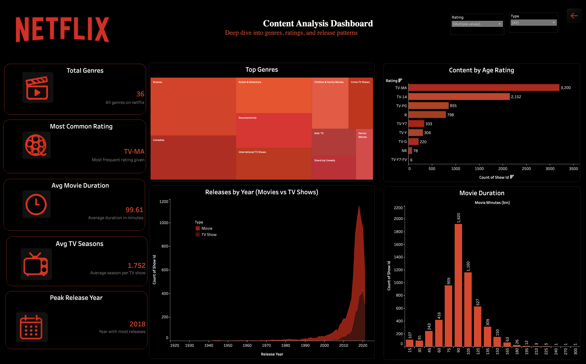
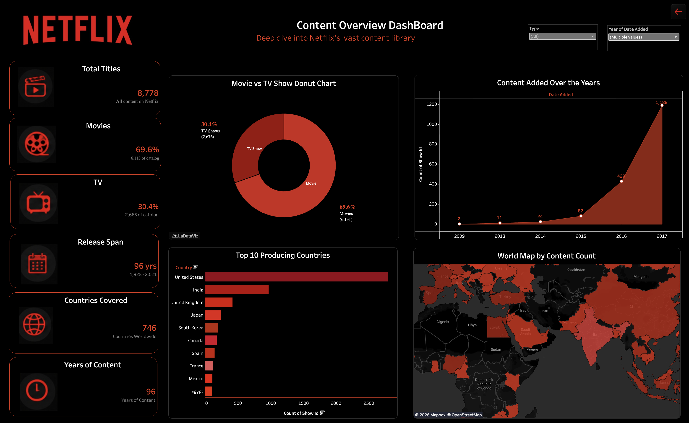

# 🎬 Netflix Data Analytics Dashboard

<p align="center">
  <strong>Interactive Tableau Dashboard for Netflix Content Intelligence</strong>
</p>

<p align="center">
  <a href="https://public.tableau.com/app/profile/neeraj.singh1868/viz/Netflix_17779544198340/Dashboard?publish=yes">
    🔴 View Live Dashboard
  </a>
</p>

---

## 📊 Project Overview

The **Netflix Data Analytics Dashboard** is an interactive Tableau-based analytics project designed to explore and understand Netflix's content library.

The project transforms raw Netflix catalog data into an interactive visual analytics experience covering:

- 🎬 Movies vs TV Shows
- ⭐ Content ratings
- 🎭 Genre distribution
- 🌍 Country-wise content production
- 📅 Release trends
- 🎥 Movie duration
- 👨‍🎬 Directors and cast members
- 📈 Content growth over time

The dashboard is organized into multiple analytical views to make it easier to explore Netflix's content ecosystem from different perspectives.

---

## 🚀 Live Dashboard

<p align="center">

🔴 **[View Interactive Dashboard on Tableau Public](https://public.tableau.com/app/profile/neeraj.singh1868/viz/Netflix_17779544198340/Dashboard?publish=yes)**

</p>

> The Tableau version allows users to interact with filters, explore charts, and investigate Netflix's content trends dynamically.

---

# 🖥️ Dashboard Preview

## 🏠 Dashboard Home

<p align="center">
  
</p>

The landing page provides navigation to the major analytical sections of the dashboard.

---

## 📌 Content Overview

<p align="center">
  
</p>

### Key metrics

- **8,778** total Netflix titles
- **69.6%** Movies
- **30.4%** TV Shows
- Content spanning **96 years**
- **746** countries represented

### Analysis includes

- Movies vs TV Shows distribution
- Content added over time
- Top content-producing countries
- Geographic distribution of Netflix content

---

## 📈 Content Analysis

<p align="center">
  
</p>

### Key analysis

- Most common Netflix genres
- Content distribution by age rating
- Movie duration distribution
- Average movie duration
- Average TV seasons
- Release trends by content type
- Peak release year

---

## 🎥 Directors & Cast Intelligence

<p align="center">
  
</p>

### Key analysis

- Total directors
- Total cast members
- Most prolific directors
- Most featured actors
- Top directors by number of titles
- Director output by country and genre
- New directors added over time
- Most frequently featured cast members

---

# 📊 Key Insights

### 🎬 Content Distribution

Netflix's catalog contains:

| Content Type | Share | Titles |
|---|---:|---:|
| Movies | **69.6%** | 6,113 |
| TV Shows | **30.4%** | 2,665 |
| **Total** | **100%** | **8,778** |

---

### ⭐ Content Ratings

**TV-MA** is the most frequently occurring rating in the dataset, followed by **TV-14** and **TV-PG**.

This provides an overview of the maturity profile of Netflix's catalog.

---

### 📅 Release Trends

The dataset shows substantial growth in Netflix content releases during the 2010s, with **2018 identified as the peak release year** in the dashboard.

---

### 🌍 Global Distribution

The dashboard analyzes Netflix content across **746 countries**, with the United States and India among the largest contributors in the dataset.

---

### 🎭 Genre Analysis

The dataset contains **36 genres**, with categories such as:

- Dramas
- Comedies
- Action & Adventure
- Documentaries
- International TV Shows
- Children & Family Movies
- Crime TV Shows
- Horror Movies

---

# 🎯 Business Questions

This dashboard was designed to answer questions such as:

1. What is the distribution of Movies and TV Shows on Netflix?
2. Which content rating occurs most frequently?
3. Which genres dominate Netflix's catalog?
4. How has Netflix's content library changed over time?
5. Which countries produce the most Netflix content?
6. Which year had the highest number of releases?
7. What is the average movie duration?
8. What is the average number of seasons for TV Shows?
9. Which directors have produced the most Netflix titles?
10. Which actors appear most frequently?
11. How has the number of new directors changed over time?
12. How does director output vary across countries and genres?

---

# 🔍 Analytical Approach

The project follows a typical data analytics workflow:

```text
Raw Netflix Dataset
        ↓
Data Cleaning
        ↓
Data Preparation
        ↓
Exploratory Data Analysis
        ↓
KPI Development
        ↓
Dashboard Design
        ↓
Interactive Visualization
        ↓
Insights & Interpretation
